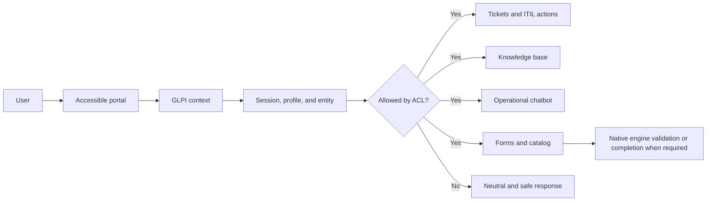

<div align="center">
  <p><a href="README.md" lang="pt-BR">Português</a> | <strong lang="en">English</strong></p>

  

  # GLPI Accessible

  **An alternative, GLPI-integrated service desk journey designed primarily for blind users, people with low vision, and keyboard users.**

  [](https://github.com/leonardosminfo/plugin_glpi_acessivel/releases)
  [](https://glpi-project.org/)
  [](https://www.php.net/)
  [](LICENSE)
  
</div>

> [!IMPORTANT]
> Version `0.2-beta` is intended for controlled pilots and community evaluation. It is not a final accessibility certification, validation of every profile/entity combination, or GLPI Marketplace approval.

## About the project

GLPI Accessible provides a more direct and assistive service desk experience without creating a parallel authorization layer. The plugin preserves the GLPI session, active entity, profile, groups, and permissions.

It **does not grant additional rights**. Queries and changes remain subject to GLPI core ACLs, business rules, and validations.

The project targets environments where the standard portal still creates barriers for screen reader users, magnification users, high-contrast users, or people who navigate exclusively with a keyboard.

## User journey

The diagram summarizes the functional flow. Equivalent text follows the diagram so the information does not depend on its visual representation.



In text: the user enters through the portal, the plugin loads the GLPI session context, and only displays or executes features allowed by the profile, entity, and object-level ACL. Complex forms may finish in the native engine to preserve conditions, targets, and validations that have not yet reached proven equivalence.

## Main features

| Area | Available capabilities |
| --- | --- |
| Accessible portal | Dedicated entry point, consistent navigation, gradual module rollout, and continuity with the standard GLPI interface. |
| Tickets | Creation, listing, search, detail, history, and ITIL actions according to the actual user and item permissions. |
| Knowledge base | Search and access to articles visible in the active context. |
| Operational chatbot | Ticket and knowledge queries, ticket creation assistance, ACL enforcement, and structured confirmations. Its public name is configurable. |
| Forms | Accessible catalog and three opening modes. Integrates with GLPI 11 Service Catalog and GLPI 10 Formcreator when installed. |
| Configuration | Accessibility modes, fallback language, VLibras, voice, optional contact masking, chatbot scope, and per-module availability. |
| Governance | Audit trail for sensitive operations, operational metrics without free-text storage, and administrator diagnostics. |

## Assistive experience

The interface is developed with **WCAG 2.2 Level AA** and the Brazilian **eMAG** as references. It still requires manual validation with assistive technologies.

- heading structure, landmarks, labels, and status regions;
- predictable focus order and visible focus indicators;
- keyboard operation and shortcuts documented in the page help;
- reflow and magnification without horizontal scrolling in the main workflows;
- high-contrast theme and `forced-colors` support;
- field-related error messages;
- dynamic updates announced without excessive screen reader verbosity;
- independent controls to start and stop voice capture or playback;
- respect for reduced-motion preferences.

Automated axe-core and Pa11y checks complement but do not replace testing with NVDA, JAWS, VoiceOver, magnifiers, and real users.

## Compatibility

| Component | Declared range | Notes |
| --- | --- | --- |
| GLPI | `>= 10.0` and `< 12.0` | GLPI 10 and 11. Validation must consider the exact version, installed plugins, profiles, entities, and data. |
| PHP | `>= 8.1` | As declared by `setup.php` and `composer.json`. |
| GLPI 11 | Native Service Catalog | Complex flows may be embedded or opened in the native engine. |
| GLPI 10 | Optional Formcreator | Integration requires a compatible, installed, and enabled Formcreator version. |
| Languages | `pt_BR` and `en_GB` | Portuguese is the primary catalog. English is still partial and may use fallback strings. |

This range is a technical compatibility declaration, not evidence that every intermediate release has been tested.

## Installation

### Install from a release package

1. Back up the GLPI database and the current plugin directory.
2. Download `glpiacessivel.zip` from the [Releases page](https://github.com/leonardosminfo/plugin_glpi_acessivel/releases).
3. Extract the package into the GLPI plugins directory.
4. Confirm that the final path is exactly `plugins/glpiacessivel`.
5. In GLPI, open `Setup > Plugins`.
6. Install and enable **GLPI Accessible**.
7. Open `/plugins/glpiacessivel/front/acessivel.php`.

> [!WARNING]
> The technical directory name must be exactly `glpiacessivel`. Do not deploy the development workspace directly to a server.

### Upgrade

1. Record the current settings and back up the database and plugin directory.
2. Replace the directory with the contents of the new `glpiacessivel.zip`.
3. Run the plugin update from GLPI.
4. Clear GLPI and browser caches.
5. Revalidate Self-Service, technician/hotliner, and Super-Admin profiles before expanding the pilot.

## Initial configuration

After enabling the plugin, review `Setup > Plugins > GLPI Accessible`:

1. **Accessibility mode:** `portal`, `embedded`, or `hybrid`. New installations default to `hybrid`; upgrades preserve existing settings.
2. **Portal modules:** each feature can be available, hidden, or disabled. These states never override GLPI ACLs.
3. **Forms:** embed the native form, open it in GLPI, or use the plugin representation with a callback to the native flow.
4. **Chatbot:** customize its public name and define where the floating button appears.
5. **Language:** the primary language comes from the GLPI session; the plugin can define a fallback for missing translations.
6. **Privacy:** email and phone masking is optional and disabled by default. When enabled, temporary disclosure requires permission, a reason, and an audit record.
7. **Voice and VLibras:** validate scope, asset origin policy, CSP, licenses, and privacy before production use.

## Forms: safe integration

The plugin provides three configurable strategies:

- **embedded native:** displays the official form inside the portal journey;
- **open in GLPI:** redirects to the native page;
- **converted with native callback:** presents an accessible plugin layer and delegates compatibility-sensitive operations to the official engine.

This separation avoids claiming full transposition where equivalence has not been proven. Nested conditions, native reference fields, attachments, multiple targets, approvals, or routing may require GLPI 11 Service Catalog or GLPI 10 Formcreator.

## Security and privacy

- the GLPI session is the authentication authority;
- profile, entity, and ACL checks run on the server and at object level;
- write requests use CSRF protection;
- sensitive actions use accessible confirmation, with stronger confirmation for critical actions;
- permission-denied responses avoid revealing out-of-scope objects;
- logs and metrics should not store complete prompts or free-text descriptions;
- personal contact masking and temporary disclosure are configurable and auditable.

Report security issues privately according to [SECURITY.md](SECURITY.md). Do not publish real ticket data, users, entities, tokens, or infrastructure details in issues.

## Voice and external resources

The code supports a `local-first` strategy for speech recognition and synthesis. The public `marketplace` package **does not distribute** offline models or runtimes whose redistribution evidence is still incomplete.

Internal environments may validate local assets or external URLs according to their CSP, licensing, and privacy policies. The installation package includes a detailed voice asset inventory under `docs/`.

## Known beta limitations

- the GLPI 10/11 matrix must still be repeated with representative profiles, entities, versions, and data volumes for each installation;
- complex forms may finish in the native engine;
- the `en_GB` translation still requires community review;
- offline voice assets are not included in the public ZIP;
- automated checks do not replace manual assistive technology testing;
- final Marketplace readiness depends on review of the published package and community validation.

## Quality baseline

The `0.2-beta` baseline includes:

- PHPUnit: **100 tests and 447 assertions**;
- PHPStan: **no errors**;
- PHPCS: **no errors** in the release gate;
- gettext catalogs rebuilt and validated with `msgfmt`;
- automated validation of the single ZIP root, version metadata, forbidden paths, and SHA-256;
- PHP and JavaScript dependency audits without known vulnerabilities at build time.

For local development:

```powershell
composer install
composer qa
npm ci
npm run a11y:pa11y
```

Authenticated accessibility tests require a valid GLPI session. Detailed test and operation guides are included in the release package under `docs/`.

## Package verification

A public release should contain:

- `glpiacessivel.zip`;
- `SHA256SUMS`;
- pre-release notes;
- the `v0.2-beta` tag.

Verify the checksum in PowerShell:

```powershell
Get-FileHash .\glpiacessivel.zip -Algorithm SHA256
Get-Content .\SHA256SUMS
```

Maintainers can build and verify the public package with:

```powershell
.\tools\build-release.ps1 -Output .release -Profile marketplace -RequireMsgfmt
.\tools\verify-release.ps1 -Package .release\glpiacessivel.zip -ExpectedVersion 0.2-beta -PublicProfile
```

## Documentation

Public files maintained at the project root:

- [Changelog](CHANGELOG.md)
- [Contributing guide](CONTRIBUTING.md)
- [Security policy](SECURITY.md)
- [Third-party notices](THIRD_PARTY_NOTICES.md)
- [GPL-2.0-or-later license](LICENSE)

The installation package also contains a `docs/` directory with detailed installation, operation, accessibility, security, testing, and voice inventory guides.

## Contributing

Accessibility barrier reports are especially valuable. When opening an issue:

- include the GLPI, PHP, plugin, and browser versions;
- describe the test profile and entity without exposing personal data;
- name the assistive technology and workflow used;
- provide reproducible steps, expected result, and observed result;
- include screenshots only when they use fictional or properly anonymized data.

Pull requests must preserve GLPI 10/11 compatibility, server-side ACL checks, internationalization, and keyboard operation.

## License

Distributed under [GPL-2.0-or-later](LICENSE). Third-party dependencies and notices are listed in [THIRD_PARTY_NOTICES.md](THIRD_PARTY_NOTICES.md).

---

<div align="center">
  An open project working to make service desk workflows more usable for everyone.
</div>
