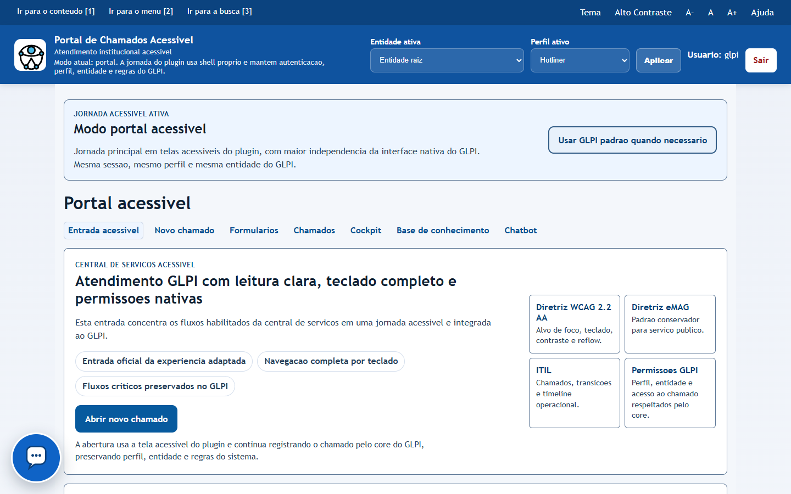
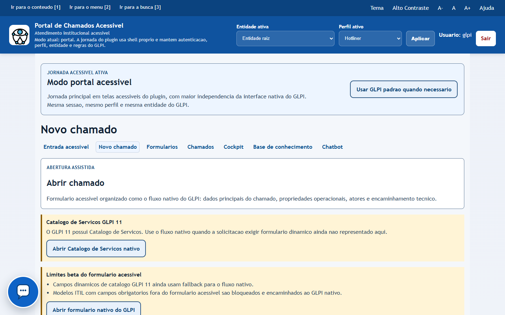
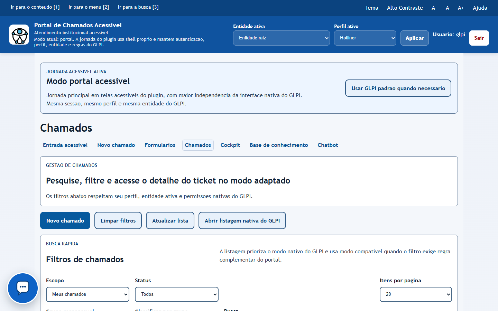
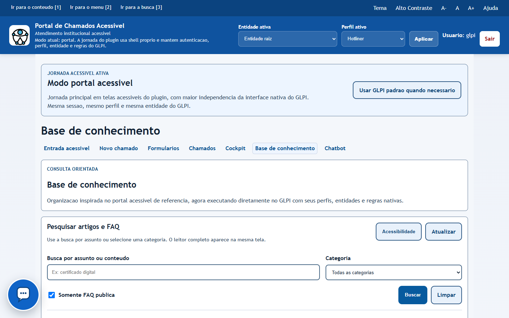
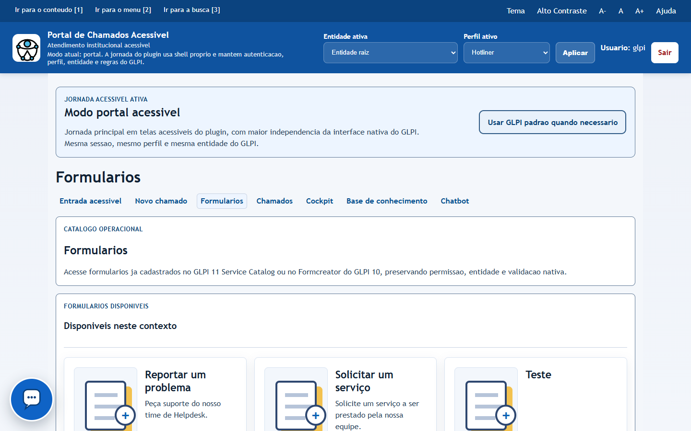
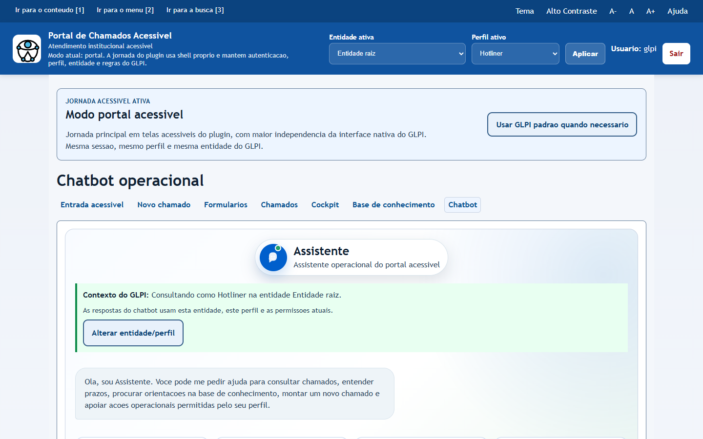
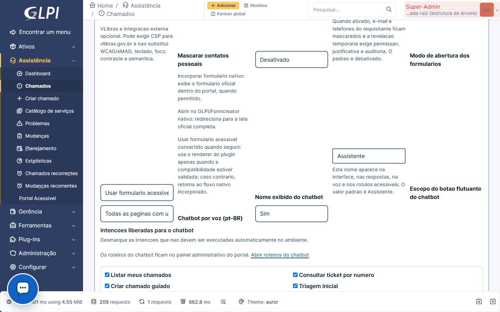
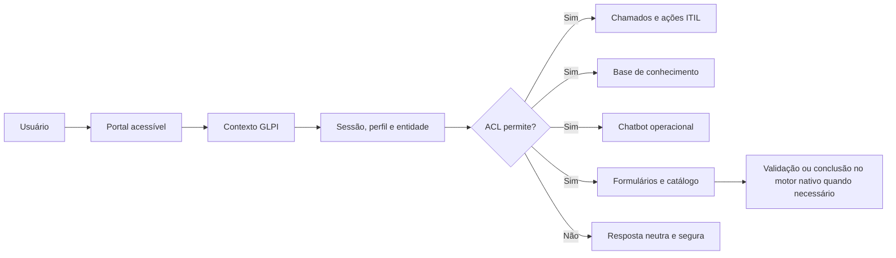

<div align="center">
  <p><strong lang="pt-BR">Português</strong> | <a href="README.en.md" lang="en">English</a></p>

  

  # GLPI Acessível

  **Uma jornada alternativa e integrada ao GLPI 10 e 11, com prioridade para pessoas cegas, pessoas com baixa visão e usuários de teclado.**

  [](https://github.com/leonardosminfo/plugin_glpi_acessivel/releases)
  [](https://glpi-project.org/)
  [](https://www.php.net/)
  [](LICENSE)
  
</div>

> [!IMPORTANT]
> A versão `0.2-beta` destina-se a pilotos controlados e avaliação comunitária. Ela não representa certificação definitiva de acessibilidade, homologação de todas as combinações de perfis e entidades ou aprovação no Marketplace GLPI.

## Sobre o projeto

O GLPI Acessível oferece uma experiência de central de serviços mais direta e assistiva sem criar uma camada paralela de autorização. O plugin preserva a sessão, a entidade ativa, o perfil, os grupos e as permissões do GLPI.

Ele **não concede direitos adicionais**. Consultas e alterações continuam submetidas às ACLs, regras de negócio e validações do core do GLPI.

O projeto foi pensado para ambientes em que o portal padrão ainda apresenta barreiras para usuários de leitores de tela, ampliação, alto contraste ou navegação exclusivamente por teclado.

## O sistema em funcionamento

As telas abaixo usam dados fictícios de homologação e ilustram fluxos sujeitos ao perfil, à entidade e às ACLs do GLPI. Elas apresentam a experiência do produto, mas não constituem, isoladamente, evidência de conformidade com WCAG ou eMAG.

### 1. Comece pela central de serviços acessível

A entrada reúne os módulos liberados pelo administrador e mantém visíveis o contexto, a entidade e o perfil usados pelo GLPI.

<p align="center">
  
</p>

### 2. Registre uma solicitação com orientação clara

A abertura assistida organiza os campos do chamado em uma sequência previsível, sem substituir templates, validações ou permissões do GLPI.

<p align="center">
  
</p>

### 3. Acompanhe os chamados permitidos pelo seu perfil

A listagem apresenta filtros e resultados autorizados pelo GLPI, permitindo chegar ao detalhe, histórico e ações ITIL disponíveis para o item.

<p align="center">
  
</p>

### 4. Pesquise orientações antes de abrir um chamado

A base de conhecimento oferece pesquisa por assunto e consulta dos artigos visíveis na entidade e no perfil ativos.

<p align="center">
  
</p>

### 5. Use formulários já cadastrados no GLPI

O catálogo apresenta formulários disponíveis no Service Catalog do GLPI 11 ou no Formcreator do GLPI 10, preservando o motor nativo quando necessário.

<p align="center">
  
</p>

### 6. Consulte o Assistente no mesmo contexto operacional

O Assistente usa o perfil, a entidade e as permissões atuais. Ações de escrita continuam protegidas por ACL, CSRF e confirmação estruturada.

<p align="center">
  
</p>

### 7. Libere recursos de forma gradual

A administração permite personalizar o nome do Assistente, os módulos apresentados e as integrações, sem transformar configuração visual em autorização.

<p align="center">
  
</p>

## Visão da jornada

O diagrama resume o fluxo funcional. O conteúdo equivalente também está descrito logo abaixo para não depender da representação visual.



Em texto: o usuário entra pelo portal, o plugin recupera o contexto da sessão GLPI e só apresenta ou executa funcionalidades permitidas pelo perfil, pela entidade e pela ACL do objeto. Formulários complexos podem concluir no motor nativo para preservar condições, targets e validações ainda não reproduzidos integralmente.

## Principais recursos

| Área | O que está disponível |
| --- | --- |
| Portal acessível | Entrada dedicada, navegação consistente, liberação gradual de módulos e continuidade com o GLPI padrão. |
| Chamados | Criação, listagem, pesquisa, detalhe, histórico e ações ITIL condicionadas pelas permissões reais do usuário e do item. |
| Base de conhecimento | Pesquisa e consulta de artigos visíveis no contexto ativo. |
| Chatbot operacional | Consulta de chamados e conhecimento, apoio à abertura e ações protegidas por ACL e confirmações estruturadas. O nome exibido é configurável. |
| Formulários | Catálogo acessível e três modos de abertura. Integra o Service Catalog no GLPI 11 e o Formcreator no GLPI 10 quando instalado. |
| Configuração | Modos de acessibilidade, idioma fallback, VLibras, voz, mascaramento opcional de contatos, escopo do chatbot e estado de cada módulo. |
| Governança | Auditoria de operações sensíveis, métricas operacionais sem armazenar texto livre e diagnósticos administrativos. |

## Experiência assistiva

A interface é desenvolvida com referência na **WCAG 2.2 nível AA** e no **eMAG**, ainda sujeita à homologação manual com tecnologias assistivas.

- estrutura de títulos, landmarks, rótulos e regiões de estado;
- ordem de foco previsível e foco visível;
- operação por teclado e atalhos documentados na ajuda da página;
- reflow e ampliação sem depender de rolagem horizontal nos fluxos principais;
- tema de alto contraste e suporte a `forced-colors`;
- mensagens de erro associadas aos respectivos campos;
- atualizações dinâmicas anunciadas por leitores de tela sem excesso de verbosidade;
- controles independentes para iniciar e interromper captura ou reprodução de voz;
- respeito à preferência por movimento reduzido.

As verificações automatizadas com axe-core e Pa11y complementam, mas não substituem, testes manuais com NVDA, JAWS, VoiceOver, ampliadores e usuários reais.

## Compatibilidade

| Componente | Faixa declarada | Observação |
| --- | --- | --- |
| GLPI | `>= 10.0` e `< 12.0` | GLPI 10 e 11; a homologação deve considerar a versão exata, os plugins e os perfis da instalação. |
| PHP | `>= 8.1` | Conforme `setup.php` e `composer.json`. |
| GLPI 11 | Service Catalog nativo | Fluxos complexos podem ser incorporados ou abertos no motor nativo. |
| GLPI 10 | Formcreator opcional | A integração depende de uma versão compatível do Formcreator instalada e habilitada. |
| Idiomas | `pt_BR` e `en_GB` | Português é o catálogo principal; inglês ainda é parcial e pode usar fallback. |

A faixa acima é uma declaração de compatibilidade técnica, não evidência de teste em toda versão intermediária. A matriz detalhada de conformidade GLPI 10/11 está incluída na documentação técnica do projeto.

## Instalação

### Pelo pacote da release

1. Faça backup do banco de dados e da pasta atual do plugin.
2. Baixe `glpiacessivel.zip` na [página de releases](https://github.com/leonardosminfo/plugin_glpi_acessivel/releases).
3. Extraia o pacote no diretório de plugins do GLPI.
4. Confirme que o caminho final é exatamente `plugins/glpiacessivel`.
5. No GLPI, acesse `Configurar > Plugins`.
6. Instale e habilite **GLPI Acessível**.
7. Abra `/plugins/glpiacessivel/front/acessivel.php`.

> [!WARNING]
> O nome técnico da pasta deve ser exatamente `glpiacessivel`. Não publique a pasta de desenvolvimento diretamente no servidor.

### Atualização

1. Registre a configuração atual e faça backup do banco e da pasta do plugin.
2. Substitua a pasta pelo conteúdo do novo `glpiacessivel.zip`.
3. Execute a atualização pelo menu de plugins do GLPI.
4. Limpe os caches do GLPI e do navegador.
5. Revalide perfis Self-Service, técnico/hotliner e Super-Admin antes de ampliar o piloto.

O pacote de instalação inclui um guia detalhado de instalação e operação no diretório `docs/`.

## Configuração inicial

Depois de habilitar o plugin, revise `Configurar > Plugins > GLPI Acessível`:

1. **Modo de acessibilidade:** `portal`, `embedded` ou `hybrid`. Instalações novas usam `hybrid` por padrão; atualizações preservam a configuração existente.
2. **Módulos do portal:** cada funcionalidade pode ficar disponível, oculta ou indisponível. Essa configuração nunca substitui a ACL do GLPI.
3. **Formulários:** escolha entre incorporar o formulário nativo, abrir no GLPI ou usar a representação do plugin com retorno ao fluxo nativo.
4. **Chatbot:** personalize o nome público e defina onde o botão flutuante aparece.
5. **Idioma:** o idioma principal vem da sessão GLPI; o plugin permite definir o fallback para traduções ausentes.
6. **Privacidade:** o mascaramento de e-mail e telefone é opcional e vem desativado por padrão. Quando habilitado, a revelação temporária exige permissão, justificativa e auditoria.
7. **Voz e VLibras:** valide escopo, política de origem dos arquivos, CSP e licenças antes de habilitar em produção.

## Formulários: integração segura

O plugin oferece três estratégias configuráveis:

- **nativo incorporado:** exibe o formulário oficial dentro da jornada do portal;
- **abrir no GLPI:** redireciona para a tela nativa;
- **convertido com callback nativo:** apresenta uma camada acessível própria e delega ao motor oficial o que ainda exige compatibilidade nativa.

Essa divisão evita prometer uma transposição total onde ainda não existe equivalência comprovada. Condições aninhadas, campos nativos, anexos, múltiplos targets, aprovações ou roteamentos podem exigir o Service Catalog do GLPI 11 ou o Formcreator do GLPI 10.

## Segurança e privacidade

- a sessão GLPI é a autoridade de autenticação;
- perfil, entidade e ACL são verificados no servidor e por objeto;
- requisições de escrita usam proteção CSRF;
- ações sensíveis usam confirmação acessível e, quando críticas, confirmação forte;
- respostas de permissão negada evitam revelar objetos fora do escopo;
- logs e métricas não devem armazenar descrições livres ou prompts completos;
- mascaramento e revelação de contatos pessoais são configuráveis e auditáveis.

Falhas de segurança devem seguir o processo privado descrito em [SECURITY.md](SECURITY.md). Não publique dados reais de chamados, usuários, entidades, tokens ou infraestrutura em issues.

## Voz e recursos externos

O código possui suporte à estratégia `local-first` para reconhecimento e síntese de voz. O pacote público `marketplace` **não distribui** modelos e runtimes offline cuja evidência de redistribuição ainda não esteja concluída.

Em ambientes internos, os administradores podem homologar assets locais ou URLs externas conforme a política de CSP, licenças e privacidade da organização. O inventário detalhado de assets de voz acompanha o pacote no diretório `docs/`.

## Limites conhecidos da beta

- a matriz GLPI 10/11 ainda precisa ser repetida com perfis, entidades e volumes representativos de cada instalação;
- formulários complexos podem concluir no motor nativo;
- a tradução `en_GB` ainda requer revisão comunitária;
- recursos offline de voz não fazem parte do ZIP público;
- validações automatizadas não substituem testes assistivos manuais;
- a aderência final ao Marketplace GLPI ainda depende da revisão do pacote publicado e da homologação comunitária.

## Qualidade e validação

A linha de base da `0.2-beta` inclui:

- PHPUnit: **101 testes e 448 asserções**;
- PHPStan: **sem erros**;
- PHPCS: **sem erros** no gate de release;
- catálogos gettext recompilados e validados com `msgfmt`;
- verificação automática de raiz única do ZIP, metadados de versão, caminhos proibidos e SHA-256;
- auditoria de dependências PHP e JavaScript sem vulnerabilidades conhecidas no momento da geração.

Para desenvolvimento local:

```powershell
composer install
composer qa
npm ci
npm run a11y:pa11y
```

Os testes de acessibilidade autenticados exigem uma sessão GLPI válida. O procedimento de auditoria autenticada acompanha o pacote no diretório `docs/`.

## Pacote e verificação

A release pública deve conter:

- `glpiacessivel.zip`;
- `SHA256SUMS`;
- notas da versão marcadas como pre-release;
- tag `v0.2-beta`.

No PowerShell, valide o checksum baixado com:

```powershell
Get-FileHash .\glpiacessivel.zip -Algorithm SHA256
Get-Content .\SHA256SUMS
```

Para mantenedores, o pacote público é gerado com:

```powershell
.\tools\build-release.ps1 -Output .release -Profile marketplace -RequireMsgfmt
.\tools\verify-release.ps1 -Package .release\glpiacessivel.zip -ExpectedVersion 0.2-beta -PublicProfile
```

## Documentação

Arquivos públicos mantidos na raiz do projeto:

- [Autoria e titularidade](AUTHORS.md)
- [Metadados de citação](CITATION.cff)
- [Histórico de alterações](CHANGELOG.md)
- [Guia de contribuição](CONTRIBUTING.md)
- [Política de segurança](SECURITY.md)
- [Avisos de terceiros](THIRD_PARTY_NOTICES.md)
- [Licença GPL-2.0-or-later](LICENSE)

O pacote de instalação também inclui o diretório `docs/` com os guias detalhados de instalação, operação, acessibilidade, segurança, testes e inventário de voz.

## Autoria e titularidade

O projeto original foi idealizado, desenvolvido e é mantido por **Leonardo da Silva Moreira**, autor e titular do código original.

O software é distribuído sob GPL-2.0-or-later. Terceiros podem criar customizações e redistribuições conforme a licença, sem remover a autoria do projeto original. Este é um projeto independente da comunidade e não é um produto oficial, patrocinado ou certificado pelo GLPI Project ou pela Teclib.

Consulte [autoria e titularidade](AUTHORS.md) e os [metadados de citação](CITATION.cff).
## Contribuindo

Relatos de barreiras de acessibilidade são especialmente importantes. Ao abrir uma issue:

- informe a versão do GLPI, PHP, plugin e navegador;
- descreva o perfil e a entidade de teste sem expor dados pessoais;
- indique a tecnologia assistiva e o fluxo executado;
- forneça passos reproduzíveis, resultado esperado e resultado observado;
- use capturas somente com dados fictícios ou devidamente anonimizados.

Pull requests devem preservar compatibilidade com GLPI 10 e 11, ACL no servidor, internacionalização e navegação por teclado.

## Licença

Distribuído sob a licença [GPL-2.0-or-later](LICENSE). Dependências e avisos de terceiros estão em [THIRD_PARTY_NOTICES.md](THIRD_PARTY_NOTICES.md).

---

<div align="center">
  Projeto em desenvolvimento aberto para tornar a central de serviços mais utilizável por todas as pessoas.
</div>
